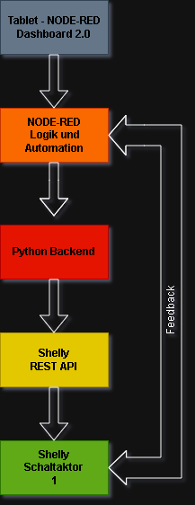

# S.A.R.A.H. - Systemarchitektur

## Phase 1: GUI + Shelly-Steuerung (bis Ende 2026)

### Komponenten
1. **Lenovo ThinkCentre** - Zentrale Steuereinheit
   - OS: Ubuntu Linux
   - RAM: 8GB
   - CPU: Intel i5
   - Software: NODE-RED, Python

2. **Shelly Gen 1 Schaltaktor** - Smart Switches
   - Verbindung: WiFi
   - Protokoll: REST API (HTTP)
   
3. **Tablet** - Bedienoberfläche
   - Software: NODE-RED Dashboard 2.0

### System-Übersicht

      
      ### Nächste Schritte
      - [x] GitHub Repository erstellen
      - [ ] Shelly IP-Adresse ermitteln
      - [ ] HTTP-Request Test durchführen
      - [ ] NODE-RED Dashboard 2.0 installieren
      - [ ] Erste GUI Prototype bauen
      
      ---
      *Stand: Work in Progress - Marc & Claude*
